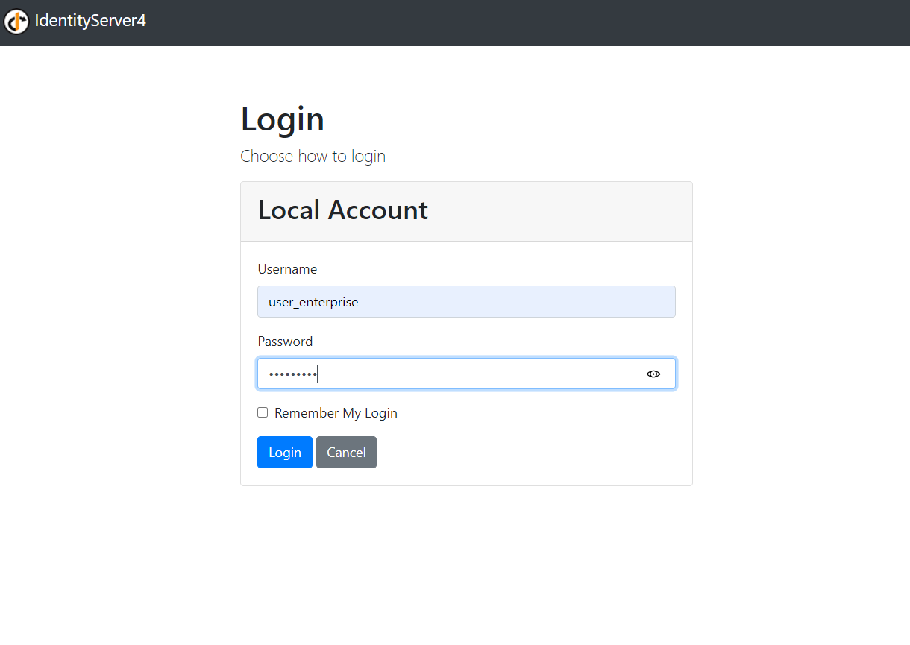

### Experimental Identity Server based on IdentityServer4

This project comprises of several projects:

* An Identity Server
* Two Client Apps (a web app and a console app) for accessing protected resources
* An API that represents a protected resource

### Running

*Before starting anything, check that you have entered DB credentials into the appsettings.json of the IdentityProvider project.*

The solution is configured to start both the Identity Provider as well as the API.

*At the initial start, the Identity Provider will create its database and execute several migration scripts. This will need a few moments to complete.*

Afterwards, you should get these two consoles representing the Identity Provider and the API.

 

You can now start one of the clients to test the environment. 

a) Client.Henkel is a console-based *machine-to-machine* client. There is no interaction involved.
2) Client.BI is a simple MVC application that involves interaction (a login procedure).

### Clients

The **non-interactive client** communicates with the Identity Provider to get its tokens, which then will be used to access the API.

The **interactive client** expects a human user to enter its credentials which then will be used to access a protected area.

In the above image we see that a token can contain additional `Claims`. These can be used by the application for further processing.

In this example, the Identity Server confirmed that this user is a member of the BI_Role "Enterprise"_and it represents the Customer "Henkel".

### Diagram - Authentication & Authorization with Identity Server

### References

* IdentityServer [Docs](https://identityserver4.readthedocs.io/)
* OpenID Connect [Home Page](https://openid.net/connect/)
* OAuth2 [Standard](https://oauth.net/2/)

### Notice

IdentityServer is just one of the [many](https://documentation.openiddict.com/) [implementations](https://www.ory.sh/) of identity platforms.

As they all implement the same OpenID Connect standard, we can replace it by any other implementation or even develop our own.
