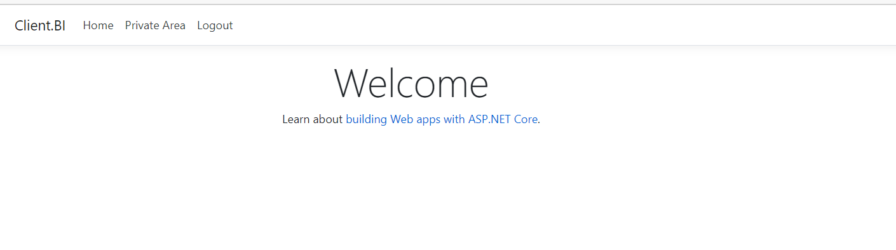
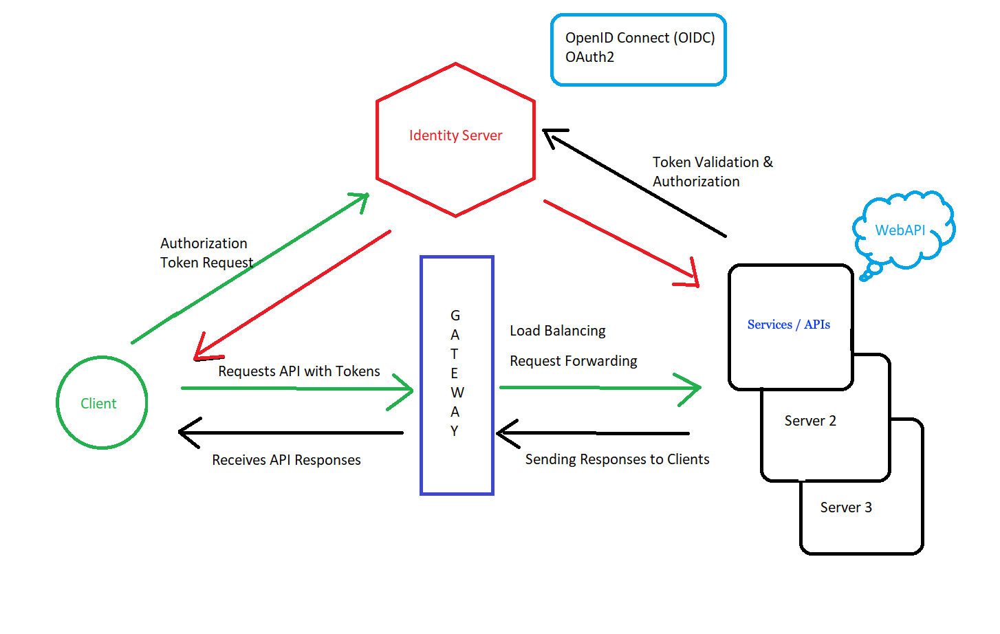

### Experimental Identity Server based on IdentityServer4

This solution consists of several projects:

* An Identity Server
* Two Client Apps (a web app and a console app) for accessing protected resources
* An API that represents a protected resource

### Running

*Before starting, ensure that you have entered valid database credentials in the `appsettings.json` of the IdentityProvider project.*

The solution is configured to launch both the Identity Provider and the API simultaneously:

*On first run, the Identity Provider will create its database and execute several migration scripts. This may take a few moments.*

After that, you should see two console windows: one for the Identity Provider and one for the API.

You can now start one of the clients to test the environment.

a) `Client.Henkel` is a console-based *machine-to-machine* client with no user interaction.  
b) `Client.BI` is a simple MVC application that involves a user login procedure.

### Clients

The **non-interactive client** communicates with the Identity Provider to obtain tokens, which are then used to access the API.

The **interactive client** requires a user to supply credentials. These credentials are then used to access protected areas.

As shown above, tokens can include additional `Claims`, which the application can use for further processing. For example, the Identity Server confirms that the user belongs to the BI_Role "Enterprise" and represents the Customer "Henkel".

### Diagram - Authentication & Authorization with Identity Server

### References

* IdentityServer [Docs](https://identityserver4.readthedocs.io/)
* OpenID Connect [Home Page](https://openid.net/connect/)
* OAuth2 [Standard](https://oauth.net/2/)

### Notice

IdentityServer is just one of the [many](https://documentation.openiddict.com/) [implementations](https://www.ory.sh/) of identity platforms.

Since they all implement the same OpenID Connect standard, it can be replaced by any other implementation—or you can develop your own.
